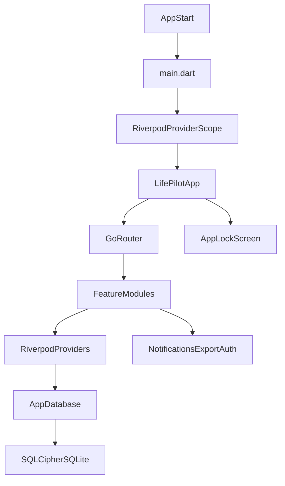

# LifePilot

[](https://flutter.dev)
[](https://riverpod.dev)
[-green.svg)](https://drift.simonbinder.eu/)
[](https://www.zetetic.net/sqlcipher/)
[](#platforms-and-runtime)
[](#license-and-ownership)

LifePilot is an offline-first Flutter application that combines task management, calendar scheduling, and personal finance tracking in one local-first product. Data is stored on-device using Drift + SQLCipher, and the app can run without a backend service.

## Table Of Contents

- [Project Overview](#project-overview)
- [Platforms And Runtime](#platforms-and-runtime)
- [Technology Stack](#technology-stack)
- [Feature Guide](#feature-guide)
- [Architecture](#architecture)
- [Codebase Structure](#codebase-structure)
- [Data Layer And Schema](#data-layer-and-schema)
- [Security And Privacy Model](#security-and-privacy-model)
- [Backup And Restore (Encrypted .lpbackup)](#backup-and-restore-encrypted-lpbackup)
- [Getting Started For Developers](#getting-started-for-developers)
- [Quick Usage Walkthrough](#quick-usage-walkthrough)
- [Screenshots](#screenshots)
- [Development Workflow](#development-workflow)
- [Testing And Quality](#testing-and-quality)
- [Troubleshooting](#troubleshooting)
- [Contribution Notes](#contribution-notes)
- [License And Ownership](#license-and-ownership)

## Project Overview

LifePilot focuses on three domains that share a single local data model:

- **Tasks:** priorities, due dates, recurring task patterns, completion state, reminder scheduling.
- **Calendar:** events with start/end times and optional reminder timestamps.
- **Finance:** income/expense entries, categories with monthly budgets, and multi-account wallet tracking.

Key technical entry points:

- App entry: [`lib/main.dart`](lib/main.dart)
- Root widget and theme wiring: [`lib/app/app.dart`](lib/app/app.dart)
- App navigation shell: [`lib/app/router.dart`](lib/app/router.dart)
- Database and migrations: [`lib/data/database/app_database.dart`](lib/data/database/app_database.dart)

## Platforms And Runtime

The repository includes Flutter targets for:

- Android (`android/`)
- iOS (`ios/`)
- Web (`web/`)
- Windows (`windows/`)
- macOS (`macos/`)
- Linux (`linux/`)

Project metadata:

- Package name: `lifepilot`
- Version: `1.0.0+1` in [`pubspec.yaml`](pubspec.yaml)
- Dart SDK constraint: `^3.9.0`
- `publish_to: 'none'` (private app package)

## Technology Stack

Runtime dependencies are defined in [`pubspec.yaml`](pubspec.yaml).

### Core Framework

- Flutter + Dart
- `flutter_riverpod` for state management
- `go_router` for shell-based tab routing

### Data And Storage

- `drift` + `drift_flutter` for typed database layer
- `sqlcipher_flutter_libs` for encrypted SQLite engine
- `flutter_secure_storage` for encryption-key persistence
- `path` + `path_provider` for database file location handling

### Product Features And Device Services

- `flutter_local_notifications`, `timezone`, `flutter_timezone` for local reminders
- `local_auth` for lock-screen authentication
- `fl_chart` for finance visualizations
- `csv`, `file_picker`, `file_saver` for import/export workflows
- `intl` for formatting

### Developer Tooling

- `build_runner` + `drift_dev` for Drift code generation
- `flutter_lints` via [`analysis_options.yaml`](analysis_options.yaml)
- `flutter_test` for unit tests

## Feature Guide

Implementation lives under [`lib/features`](lib/features).

### Dashboard

- Consolidated summary cards for daily view and finance snapshots
- Global search provider that filters tasks, calendar events, and finance entries by case-insensitive text match
- Quick actions routed into task, event, and transaction creation flows

Related files:

- [`lib/features/dashboard/dashboard_screen.dart`](lib/features/dashboard/dashboard_screen.dart)
- [`lib/features/dashboard/search_provider.dart`](lib/features/dashboard/search_provider.dart)

### Todo And Recurring Tasks

- Task priorities (`low`, `medium`, `high`) with sort/filter controls
- Recurrence patterns (`daily`, `weekly`, `monthly`) via next-date calculation
- Completion flow can auto-create next recurring item and re-schedule reminders

Related files:

- [`lib/features/todo/todo_screen.dart`](lib/features/todo/todo_screen.dart)
- [`lib/features/todo/todo_providers.dart`](lib/features/todo/todo_providers.dart)

### Calendar

- Date/time event scheduling with reminder support
- Event lifecycle persisted in local Drift table

Related files:

- [`lib/features/calendar/calendar_screen.dart`](lib/features/calendar/calendar_screen.dart)
- [`lib/features/calendar/calendar_providers.dart`](lib/features/calendar/calendar_providers.dart)

### Finance

- Income/expense tracking
- Category budget thresholds (80% warning and 100% exceeded notifications)
- Account-based balances and transfer-aware recalculation
- Monthly cumulative income vs expense trend computation for charts

Related files:

- [`lib/features/finance/finance_screen.dart`](lib/features/finance/finance_screen.dart)
- [`lib/features/finance/finance_providers.dart`](lib/features/finance/finance_providers.dart)

### Settings And Local Data Management

- Theme mode (`system`, `light`, `dark`)
- Custom currency code (default `LKR`)
- Export Encrypted Backup (`.lpbackup`)
- Import Encrypted Backup (`.lpbackup`)
- Export CSV
- Export JSON (legacy)
- Import JSON (legacy)
- Clear-all local data action

Related files:

- [`lib/features/settings/settings_screen.dart`](lib/features/settings/settings_screen.dart)
- [`lib/core/services/export_service.dart`](lib/core/services/export_service.dart)

## Architecture

LifePilot uses a feature-first structure with Riverpod providers orchestrating business state over a Drift persistence layer.



High-level responsibilities:

- **App shell/navigation:** [`lib/app`](lib/app)
- **Shared services/widgets/constants:** [`lib/core`](lib/core)
- **Database and provider wiring:** [`lib/data/database`](lib/data/database)
- **Domain features:** [`lib/features`](lib/features)

## Codebase Structure

```text
lib/
|-- app/                    # App bootstrap, routing, theming
|   |-- app.dart
|   |-- router.dart
|   `-- theme.dart
|-- core/
|   |-- constants/          # Static app constants
|   |-- services/           # Notification, export, encryption utilities
|   |-- utils/              # Date/format helper methods
|   `-- widgets/            # Shared UI components (glass panels, scaffold, etc.)
|-- data/
|   `-- database/           # Drift tables, migrations, database providers
|-- features/
|   |-- dashboard/
|   |-- todo/
|   |-- calendar/
|   |-- finance/
|   `-- settings/
`-- main.dart
```

## Data Layer And Schema

Database definition: [`lib/data/database/app_database.dart`](lib/data/database/app_database.dart)

- Database engine uses Drift.
- Encryption key is applied with `PRAGMA key`.
- Current schema version is `4`.
- Migrations include:
  - recurring-task columns in `tasks`
  - budget column in `categories`
  - accounts table and account references in `transactions`

### Tables

| Table | Drift class | Purpose |
| :--- | :--- | :--- |
| `tasks` | `Tasks` | Todo items, priority, due/reminder time, recurrence metadata |
| `events` | `CalendarEvents` | Calendar scheduling records with start/end/reminder times |
| `transactions` | `FinanceEntries` | Income/expense/transfer records and account linkage |
| `accounts` | `Accounts` | Wallet/account balances and metadata |
| `categories` | `Categories` | Shared task/finance categories and optional monthly budget |
| `app_settings` | `AppSettingsTable` | Theme mode, currency, and seed status |

### Data Operations

- Streaming read APIs (`watchTasks`, `watchEvents`, `watchFinanceEntries`, etc.)
- Upsert-based save operations (`insertOnConflictUpdate`)
- Import pipeline (`importJson`) and reset pipeline (`clearAllData`)
- Account balance reconciliation (`recalculateAccountBalances`)

## Security And Privacy Model

Security components:

- Key management: [`lib/core/services/encryption_service.dart`](lib/core/services/encryption_service.dart)
- DB encryption setup: [`lib/data/database/app_database.dart`](lib/data/database/app_database.dart)
- App lock providers/UI: [`lib/features/settings/auth_provider.dart`](lib/features/settings/auth_provider.dart), [`lib/features/settings/lock_screen.dart`](lib/features/settings/lock_screen.dart)

Implemented behavior:

- A 256-bit key is generated (if missing) and saved via `flutter_secure_storage`.
- SQLCipher key is applied when opening the local SQLite file.
- If database decryption fails, the invalid local DB file is removed to recover startup.
- App lock re-authenticates on resume and locks on paused/inactive lifecycle events.
- Biometrics can be unavailable; app lock falls back to `notSupported` state.

## Backup And Restore (Encrypted .lpbackup)

Encrypted backup is available in **Settings -> Local data** and is the recommended backup path.

### Backup Encryption Model

- File extension: `.lpbackup`
- Container type: UTF-8 encoded JSON structure
- KDF: `PBKDF2-HMAC-SHA256`
- Iterations: `100000`
- Cipher: `AES-256-GCM`
- Key length: `256-bit`
- Random salt/nonce generated per backup

Backup container fields:

- `format` (`lifepilot-backup-v1`)
- `kdf`
- `iterations`
- `cipher`
- `salt` (base64)
- `nonce` (base64)
- `ciphertext` (base64)
- `mac` (base64)

### Export Password Flow

- User taps **Export Encrypted Backup**.
- Dialog: **Create backup password**.
- Validation:
  - minimum length: 8 characters
  - password and confirmation must match
- On success, app writes `lifepilot-backup.lpbackup`.

### Restore Password Flow

- User taps **Import Encrypted Backup**.
- Dialog: **Unlock encrypted backup**.
- Password is required before decrypting.
- On successful decrypt and parse, payload is sent to `database.importJson(...)`.

### Error Handling Shown To Users

- `Wrong password or corrupted backup file.`
- `Invalid backup file format.`
- `Unable to decrypt backup file.`

### Current Backup Scope And Limitations

Included in encrypted backup payload:

- `tasks`
- `events`
- `transactions`
- `categories`
- `currency`
- metadata such as `app` and `exportedAt`

Current restore limitations (as currently implemented):

- Accounts are not exported/imported as full account records.
- Transaction account linkage and transfer relationships are not fully restored.
- Backed-up custom categories are not restored one-to-one; category seeding occurs during import flow.
- Full app settings are not restored; currency is restored, but theme and other settings are not fully replicated.

Legacy compatibility:

- JSON import/export remains available via **Export JSON (legacy)** and **Import JSON (legacy)**.

## Getting Started For Developers

### Prerequisites

- Flutter SDK compatible with Dart `^3.9.0`
- Run environment checks:
  - `flutter --version`
  - `flutter doctor -v`
- Platform toolchains for target platforms:
  - Android: Android SDK + emulator/device
  - iOS/macOS: Xcode + CocoaPods (macOS)
  - Windows desktop: Visual Studio with Desktop C++ workload
  - Linux desktop: GTK/build dependencies required by Flutter docs
- Git and terminal access
- At least one runnable target confirmed with `flutter devices`

### 1) Validate Environment

```bash
flutter --version
flutter doctor -v
```

### 2) Install Dependencies

```bash
flutter pub get
```

### 3) Generate Drift Code

```bash
dart run build_runner build --delete-conflicting-outputs
```

Use watch mode during active schema/model changes:

```bash
dart run build_runner watch --delete-conflicting-outputs
```

### 4) Run The App

```bash
flutter run
```

Platform-specific examples:

```bash
flutter run -d chrome
flutter run -d windows
flutter run -d android
```

### 5) Run Tests

```bash
flutter test
```

### 6) Run Static Analysis

```bash
flutter analyze
```

## Quick Usage Walkthrough

Suggested first-run flow:

1. Open **Dashboard** and review summary cards.
2. Add a task in **Todo**, including priority and optional recurrence.
3. Add an event in **Calendar** with optional reminder time.
4. Add income/expense entries in **Finance** and review category/trend visuals.
5. Open **Settings** to configure currency/theme.
6. In **Settings -> Local data**, export an encrypted `.lpbackup`.
7. Test restore by importing the `.lpbackup` with the same password.

## Screenshots

Place screenshots in `screenshots/` (or `docs/screenshots/`) and keep filenames stable:

- `dashboard.png`
- `todo.png`
- `calendar.png`
- `finance.png`
- `settings-local-data.png`
- `backup-password-dialog.png`
- `restore-password-dialog.png`

Suggested markdown placeholders:

```md


```

## Development Workflow

Recommended local workflow:

1. Pull latest changes.
2. `flutter pub get`
3. If Drift models changed, run build_runner generation.
4. Run app (`flutter run`) and validate changed feature flow.
5. Run `flutter test` and `flutter analyze` before opening PR.

## Testing And Quality

Current tests are in [`test/life_pilot_utils_test.dart`](test/life_pilot_utils_test.dart).

Covered areas include:

- Date helper correctness
- Finance summary math and category grouping
- Notification ID ranges for task/event reminders
- Recurrence date calculations (daily/weekly/monthly boundaries)
- Budget threshold transition logic
- Search matching behavior
- Financial trend aggregation
- Transfer-aware account balance calculation

Current testing posture:

- Unit-level logic coverage exists.
- No CI pipeline configuration is currently present in this repository.

## Troubleshooting

### Drift Codegen Issues

If generated files are stale or conflicting:

```bash
dart run build_runner build --delete-conflicting-outputs
```

### Flutter Dependency Or Build Problems

Try:

```bash
flutter clean
flutter pub get
```

Then rerun build_runner and start the app again.

### Notification Or Biometric Behavior

- Verify OS permissions for notifications and biometrics on the test device.
- Test on a physical device when simulator/emulator support is limited.

## Contribution Notes

This repository currently has no separate `CONTRIBUTING.md`, so use these defaults:

- Keep changes scoped by feature module (`lib/features/...`).
- Preserve feature-first organization and Riverpod-driven state flow.
- Regenerate Drift code when schema/table definitions change.
- Update README/docs when public behavior or developer workflow changes.
- Run analyze and tests before requesting review.

## License And Ownership

This project is currently marked private (`publish_to: 'none'` in [`pubspec.yaml`](pubspec.yaml)) and README badge indicates private licensing. Do not redistribute code/assets unless explicit permission is provided by the project owner.
